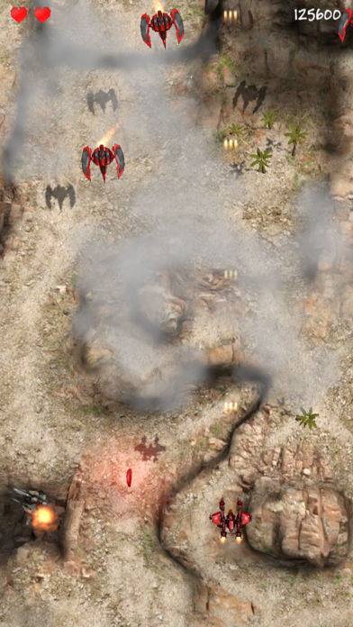

# Shooting Maniac

* [Video](https://youtu.be/4KKqbGSYzpg)
* [iOS Market](https://itunes.apple.com/kr/app/shooting-maniac/id1277477221?l=en&mt=8)
* [Android Market](https://play.google.com/store/apps/details?id=com.polygontek.ShootingManiac)

## Source

* [Engine Source](https://github.com/PolygonTek/BlueshiftEngine/releases/tag/v0.5.0)
* [ShootingManiac.7z.001](https://github.com/PolygonTek/BlueshiftDocument/raw/master/ShootingManiac/ShootingManiac.7z.001)
* [ShootingManiac.7z.002](https://github.com/PolygonTek/BlueshiftDocument/raw/master/ShootingManiac/ShootingManiac.7z.002)

## Instruction

Download and uncompress the file ShootingManiac.7z.

Run BlueshiftEditor.

Select the ShootingManiac folder from the File/Open Project menu.
Build the platform project from the Project/Build Settings... menu.
And Build this platform project.

## Link

* [Home](../README.md)
* [Prev](../StreetDodge/StreetDodge.md)
* [Next](../KingOfParking/KingOfParking.md)

