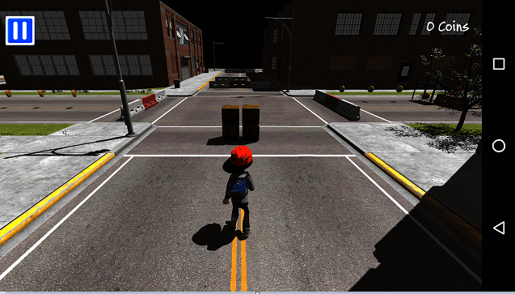

# Street Dodge

* [Video](https://youtu.be/-NZZMA0MqvQ)
* [iOS Market](https://itunes.apple.com/kr/app/street-dodge/id1188185020?l=en&mt=8)
* [Android Market](https://play.google.com/store/apps/details?id=com.polygontek.StreetDodge)

## Source

* [Engine Source](https://github.com/PolygonTek/BlueshiftEngine/releases/tag/v0.2.2)
* [StreetDodge.7z.001](https://github.com/PolygonTek/BlueshiftDocument/raw/master/StreetDodge/StreetDodge.7z.001)
* [StreetDodge.7z.002](https://github.com/PolygonTek/BlueshiftDocument/raw/master/StreetDodge/StreetDodge.7z.002)

## Instruction

Download the file StreetDodge.7z.

Run BlueshiftEditor.

Select the StreetDodge folder from the File/Open Project menu.
and select the stage1.map from the File/Open Scene menu.

Build the platform project from the Project/Build Settings... menu.

## Link

* [Home](../README.md)
* [Prev](../BasicGame/BasicGame.md)
* [Next](../ShootingManiac/ShootingManiac.md)

